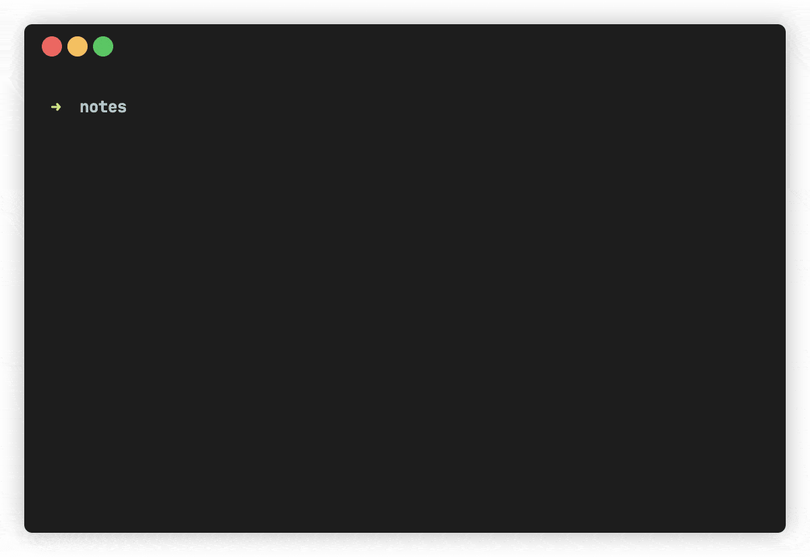

# note-cli
Simple CLI tool to manage weekly notes.



## Install
```
#Set GOPATH
export PATH=$PATH:$GOPATH/bin


git clone git@github.com:zfz7/note-cli.git

cd note-cli/note && go install
```

## Setup
Run `note setup` to open all note settings config file.

## Usage
Run `note open` to open notes

```
note o          #Opens this week notes
note o -t -1    #Opens last week notes
note o -t 1     #Opens next week notes
```
